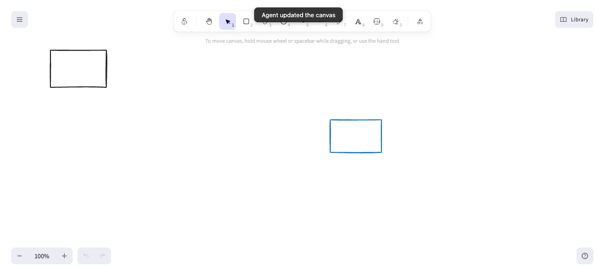
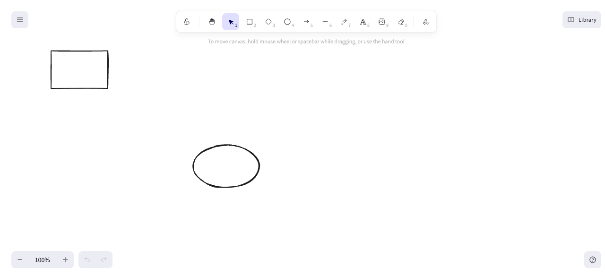

# QA — feat/scene-edit-core — 2026-06-04 (ADR-0007 conflict-resolution smoke test)

**Scope:** Final smoke test of the ADR-0007 conflict-resolution work (the
re-read + union-by-id merge on every write). Confirm the three races the prior
report flagged are closed in the **running app**: forward race (#16), reverse
race (#17), and the unsaved-element flicker (#18). Plus the supporting sync
invariants (echo guard, appState whitelist, agent→browser live path, first-load).
This is a follow-up to and uses the same repro recipes as the baseline report
`docs/qa/2026-06-04-feat-scene-edit-core.md` (which it does **not** overwrite).

**App:** http://localhost:4040/ (started by qa via `bun run duet` on the freshly
`bun run build`-ed `dist/`; the user's own 3737 instance was left untouched).
**Driver:** agent-browser (real Duet client, for render observation) + a WS client
surrogate for the human's browser save (identical `{type:"save"}` bytes App.tsx
sends after its 400ms debounce) + the real agent path (`open()`/`save()` from
`src/open.ts`, whose file write the watcher broadcasts). Disk file = source of truth.

## Summary
- blocker: 0 · major: 0 · minor: 0 · **1 test-coverage gap (not a product defect)**
- **All three races from the baseline report are closed in the running app.** The
  forward race (#16) and reverse race (#17) — the two data-loss findings — were
  reproduced live with the exact baseline recipes and both now preserve every
  element. The ADR-0007 "broadcast the merged scene back to the sender too"
  invariant holds. Echo guard, appState whitelist, and the agent→browser live
  path all pass; console and page errors are clean.
- The #18 flicker (cosmetic, no data loss) could **not be reproduced live**:
  programmatic drawing on the Excalidraw canvas was unreliable in this
  environment (see the gap note). Its logic is covered by `client-merge.test.ts`
  (8 tests, including the 2 new B2 cases). Suite: **258 pass / 0 fail**.

## Findings

No blocker / major / minor product defects found. The baseline report's
**[major] silent lost update on concurrent edit** is **confirmed fixed** in the
running app (both directions below). The baseline **[blocker] scrambled bound-text
labels** was already fixed in #14 and was out of scope for this smoke test (these
races use plain rectangles/ellipses, not bound labels).

## Races — live results (the focus of this pass)

### [PASS] Forward race (#16) — human edit during the agent's open→save window survives
- **Recipe (baseline):** file `[H1]`; agent `open()` (baseline snapshot `[H1]`,
  held); human draws `H2` (file → `[H1, H2]`); agent adds a box and `save()`s.
- **How driven:** the agent process (`open()` + signal-gated `save()`) holds its
  `[H1]` baseline; the human's `H2` lands via the WS save surrogate (disk →
  `[H1, H2]`); the agent is then signalled to add `agentBox` and `save()`.
- **Expected:** `H2` survives (`save()` re-reads disk + `mergeById`).
- **Actual:** final disk = `["H1", "H2", "agentBox"]`. **H2 survived.** The real
  client shows H1 + H2 (agentBox is on disk, just below the viewport fold).
- **Evidence:** 
  - agent log: `baseline ids: [H1]` → `signal received; disk now: [H1, H2]` →
    `FINAL disk ids: [H1, H2, agentBox]`.

### [PASS] Reverse race (#17) — a stale 400ms browser save does not clobber a concurrent agent write
- **Recipe (baseline):** agent writes `[H1, A_agent]`; a stale, debounced browser
  save carrying `[H1, H_human]` (snapshot captured before `A_agent` existed) lands.
- **How driven:** the agent path writes `A_agent` (disk → `[H1, A_agent]`,
  broadcast); the WS surrogate then sends the stale `[H1, H_human]` (no `A_agent`).
- **Expected:** `A_agent` survives AND `H_human` is applied; the merged scene is
  broadcast to **all** tabs including the sender.
- **Actual:** final disk = `["H1", "A_agent", "H_human"]`. **`A_agent` survived
  the stale overwrite and `H_human` was applied.** This is the baseline report's
  data-loss finding, now closed.

### [PASS] ADR-0007 invariant — the saving client receives the merged truth back (`server.publish`, not `ws.publish`)
- **How driven:** a WS client sent the stale `[H1, H_human]` save and recorded the
  `scene` broadcast it received afterward.
- **Actual:** the sender received back `[H1, A_agent, H_human]` — i.e. the merged
  scene including the agent's concurrent `A_agent` it never sent. Exactly one
  broadcast arrived (no bounce-storm), which also evidences the echo guard.

### [coverage gap, not a defect] Flicker (#18) / B2 — not reproduced live
- **Why:** the #18 flicker requires an in-progress human element **drawn on the
  canvas but not yet saved**, then an agent scene arriving. Reproducing it needs
  real canvas drawing. Programmatic pointer input into Excalidraw was unreliable
  here: Playwright `page.mouse` drew once then became flaky; agent-browser CDP
  `mouse` as separate commands loses the button-down state between processes;
  `batch` (even with inter-move waits) was not registered as a drag; synthetic
  `PointerEvent`s produced only degenerate `width: 0` shapes. The WS surrogate
  cannot stand in here because the element exists **only** on the canvas, never
  over the wire — that is the whole point of the flicker.
- **Coverage that does exist:** `src/client-merge.test.ts` (8 unit tests) locks
  `mergeRemoteScene`, including the #18 in-progress-element keep, the browser
  tombstone-not-resurrected case, and the **2 new B2 cases** (an agent
  hard-deleted id is dropped via the `prevRemoteIds` baseline; an in-progress
  local add is still kept). B2 is latent in v0.1 (no delete verb in `Verbs`), so
  it is not reachable through the running app regardless.
- **Recommendation:** if a live flicker check is wanted later, expose the
  Excalidraw API on `window` in a dev/test build so a draw can be injected via
  `updateScene`, or add a Playwright-trace-based canvas-drag helper. Tracked as a
  test-tooling follow-up, not a product bug.

## Supporting invariants — live results

- **[PASS] Agent → browser live path + flash.** An agent `open()`/`save()` adding
  a box appeared live in the running client, with the "Agent updated the canvas"
  flash (genuine agent update, not first-load), and the pre-existing `H1` was
  preserved. 
- **[PASS] First-load render, no flash.** Opening the app on a non-empty file
  rendered `H1` immediately; the flash only fired on later agent edits.
  
- **[PASS] Human save renders in the client.** A WS human save adding an ellipse
  fanned out to the real client, which rendered both shapes.
  
- **[PASS] appState whitelist.** A save carrying noise keys (`scrollX`, `scrollY`,
  `zoom`, `selectedElementIds`, `cursorButton`) persisted only
  `viewBackgroundColor` + `gridSize` to disk; every noise key was dropped.
- **[PASS] Echo guard / no bounce-storm.** Each write produced exactly one
  broadcast to subscribers; no duplicate re-broadcast of Duet's own write.
- **[PASS] Two-client fan-out.** During the race tests, the real agent-browser
  client and an independent WS client received the same broadcast for one write.

## Checklist results
- **Console errors:** clean (0 messages over the session).
- **Page errors:** clean (no uncaught exceptions, no React errors).
- **Network:** clean — `GET /` → 200, assets load, WS connects and stays open.
- **Input validation (server save path):** the server merges and whitelists every
  incoming save; noise appState keys are dropped, malformed merges are not
  observed.

## Notes / harness
- The "human browser edit" was driven by a WS client sending the byte-identical
  `{type:"save", elements, appState}` message `App.tsx:168` sends — the same path
  the baseline report used for its race repros — because programmatic Excalidraw
  canvas drawing was unreliable in this environment (see the gap note).
- Read-only run: no app code, config, or tests were edited; no issues filed.
  Scratch harness lives under `/tmp/duet-qa/`.
