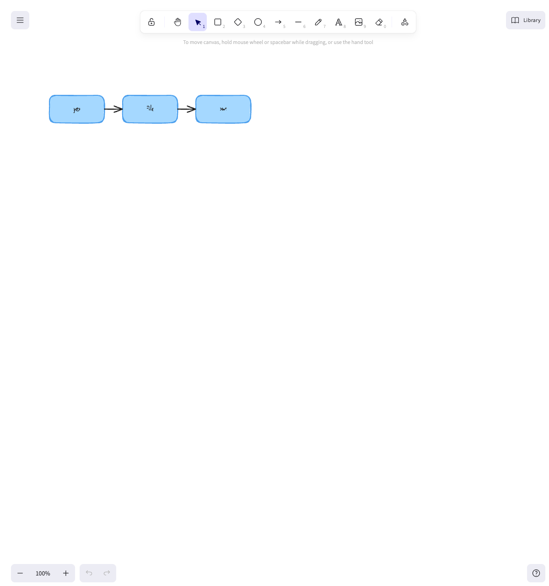
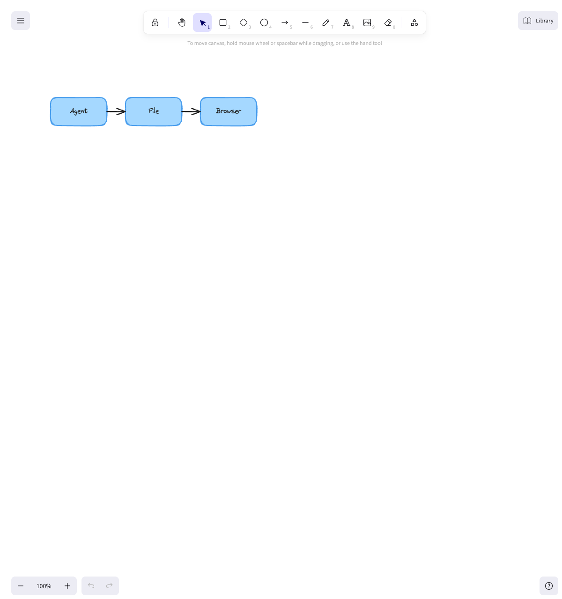
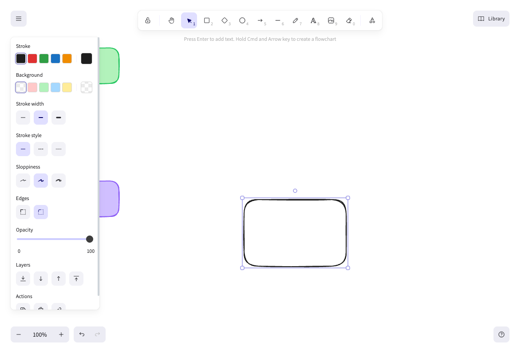
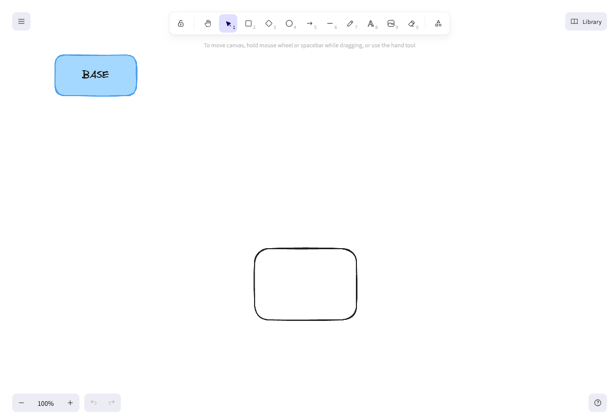

# QA — feat/scene-edit-core — 2026-06-04

**Scope:** Changes on this PR (`main...HEAD`) — the agent authoring pipeline
(`open()` load-or-create handle, authoring verbs, `pipeline()`), the
geometry-check-on-`save()`, layout helpers (`bbox`/`centerX`/`centerY`), and
fail-fast on malformed `.excalidraw` files. Plus a core-sync sanity check
(user asked to confirm core functionality still works).
**App:** http://localhost:3737/ (started by qa via `bun run duet`)
**Driver:** playwright-cli (headed) for the browser render; `bun` driver scripts for the API.

## Summary
- blocker: 1 · major: 1 · minor: 0
- **[blocker] Bound-text labels render as scrambled glyphs.** The new authoring
  API writes bound labels with `width: 0` expecting Excalidraw to re-measure on
  load — it does not, so every label (`labeledRect`, `pipeline`, arrow label)
  renders as tiny garbled characters. Regression introduced by this PR (`4545c7d`).
- **[major] Silent lost update on concurrent edit.** If a human draws between the
  agent's `open()` and `save()`, the agent's blind full-file overwrite drops the
  human's edit with no warning. `open()` snapshots; `save()` overwrites; no
  re-read, version check, or merge.
- Everything else works: load-or-create, defer-write, geometry auto-fix vs
  structural abort, malformed-file fail-fast, layout helpers, echo guard,
  appState whitelist, human-drawn preservation (non-concurrent), and **core
  file→browser + agent→browser live sync all pass.**

## Findings

### [blocker] Bound-text labels render scrambled (width: 0 not re-measured)
- **Flow:** Agent authors a scene (`open()` → `pipeline()`/`labeledRect` → `save()`) → renders in the browser.
- **Repro:**
  1. `const s = open("scene.excalidraw"); s.pipeline(["Agent","File","Browser"]); s.save();`
  2. `bun run duet scene.excalidraw`, open http://localhost:3737/.
  3. Look at the three boxes.
- **Expected:** Boxes labeled "Agent", "File", "Browser".
- **Actual:** Boxes show tiny scrambled glyphs. The saved JSON has the right
  `text`/`originalText` ("Agent" etc.) but `width: 0` on every bound-text
  element. Excalidraw renders the text into a 0-width box instead of
  re-measuring, which mangles it.
- **Root cause:** commit `4545c7d` ("feat(#9): drop 0.55 width from bound labels;
  geometry detects at check time") changed the bound-label width from a real
  estimate (`width: tw` on `main`) to `width: 0`. Affects both label sites:
  `src/authoring.ts:180` (`labeledRect`) and `src/authoring.ts:212`
  (`pushArrowLabel`, used by `arrow(...,label)` and `connect({label})`).
  Standalone `text()` is unaffected (it still stores a real width).
- **Proof it's the width:** patching the saved file's label widths to the 0.55
  estimate (and re-centering x) makes all three labels render correctly through
  the same server — see the two screenshots below.
- **Evidence:**
  - Broken (PR output, `width: 0`): 
  - Fixed (same scene, real widths): 
  - The comment in `authoring.ts` ("width=0 so Excalidraw measures and re-centers
    on load") states the assumption that this PR relies on and that the render
    disproves.

### [major] Silent lost update when agent and human edit concurrently
- **Flow:** Agent and human editing the same drawing at the same time (Duet's
  core promise — "both sides edit it and Duet keeps every browser tab in sync").
- **Repro (deterministic, run as one process):**
  1. File state A = `[H1]` (one human element).
  2. Agent calls `open(file)` → snapshots `[H1]`.
  3. Human draws `H2` in the browser → WS save writes file = `[H1, H2]`.
  4. Agent (still holding the step-2 snapshot) calls `save()`.
  5. Final file = `[H1, agentBox, agentBox_t]`. **`H2` is gone.**
- **Expected:** The human's `H2` is preserved (merged, or the agent re-reads, or
  the conflicting save is rejected/warned).
- **Actual:** `H2` silently lost. `open()` reads a snapshot once; `save()` does a
  full-file `atomicWriteScene` of that snapshot + the agent's additions, with no
  re-read, no version/mtime check, and no merge — so any human write landing in
  the open→save window is overwritten.
- **Why it matters:** Agents typically hold the handle open across async work
  (reasoning, calling several verbs over seconds), so the overlap window is not
  microscopic. A `reconcile` module is referenced in the type comments but
  `open()`/`save()` does not use it.
- **Reverse direction — also confirmed.** The browser's debounced `save`
  (`SAVE_DEBOUNCE_MS = 400`) sends a *full-scene snapshot captured at edit time*,
  and the server writes it wholesale (`writeSceneFile(filePath, {elements})`,
  `server.ts:92`). So if an agent writes element `A` during the 400ms window, the
  browser's debounce fires its stale snapshot and overwrites the file —
  reproduced via a WS client: agent wrote `[base, A_agent]`, the stale browser
  save landed, final file = `[base, H_human]`, **`A_agent` lost.** Every fresh
  human onChange resets the 400ms timer, so a human drawing continuously widens
  the window in which an agent edit can be clobbered.
- **Unsaved in-progress human element flickers (minor, transient).** When a
  remote agent scene arrives, `applyScene` replaces the whole canvas
  (`App.tsx:58`), so a human element drawn but not yet debounce-saved disappears
  from view for up to 400ms until the pending save round-trips and re-adds it.
  Not data loss (that is the reverse race above), but a visible glitch.
- **Note:** the *non-concurrent* case is fine — when the agent `open()`s a file
  that already contains human-drawn elements and saves, those are preserved
  verbatim (test A below, and the browser screenshot 04 shows the human's
  rectangle surviving an agent edit + keeping its selection).
- **Evidence:** agent + human both present after a sequential edit:
  

## Things that passed (API driver + browser)

- **open() load-or-create:** opening a non-existent path starts empty and writes
  nothing until `save()`; round-trips 8 elements on reopen.
- **Malformed fail-fast:** `open()` throws a clear error on invalid JSON, a JSON
  array, an object with no `elements` array, and `null` — none silently create
  an empty scene.
- **Geometry on save():** structural overlap aborts `save()` (throws, nothing
  written); mechanical `spacing-too-close` auto-fixes and reports it in
  `fixed`; `save({check:false})` writes as-is without throwing.
- **connect():** throws on a missing box id.
- **Layout helpers:** `bbox` union, `centerX`, and `centerY` shifts compute
  correctly.
- **Human-drawn preservation (sequential):** opening a file with an unknown-id
  human element, adding an agent element, and saving keeps the human element and
  its custom fields verbatim.
- **appState whitelist:** `atomicWriteScene` drops noise keys (`scrollX/Y`,
  `zoom`, `selectedElementIds`), keeps `viewBackgroundColor`/`gridSize`.
- **Echo guard:** `writeSceneFile` registers the written-bytes hash (consumed by
  the watcher so Duet's own write doesn't bounce); the new `atomicWriteScene`
  does *not* register (correct — the agent path manages its own guarding).
- **Geometry auto-fixes:** off-canvas outlier pulled back near the cluster;
  label-wider-than-box grows the box; both reach `ok: true`.
- **pipeline() edge counts:** `pipeline(0)` → 0 boxes/0 arrows; `pipeline(1)` →
  1/0; `pipeline(4)` → 4/3.
- **Dark mode:** `darkbg` backdrop is excluded from box-overlap detection (no
  false positives).
- **Data safety on abort:** a `save()` aborted by a structural violation leaves
  an existing valid file byte-for-byte untouched.
- **Core live sync (browser):** editing the watched file pushed the change to the
  browser; an agent `open()`/`save()` made the new box appear live in an open
  tab; a human-drawn rectangle saved to the file and survived the agent edit.
- **Two-tab fan-out + echo guard (browser):** with two tabs open on the same
  file, a rectangle drawn in tab 0 appeared in tab 1 and did not bounce back to
  the sender (`ws.publish` excludes the sender). 

## Checklist results
- **Console errors:** clean. The `[ERROR] [duet] applyScene/handleChange ...`
  lines are the app's own debug logging routed through `console.error`, not real
  errors. No uncaught exceptions, no React errors.
- **Network failures:** clean. `GET /` → 200, assets load, WS connects.
- **Form validation (API input validation):** clean. All adversarial inputs
  (malformed files, missing-box connect, overlap) are rejected with clear errors
  or auto-fixed as designed.
